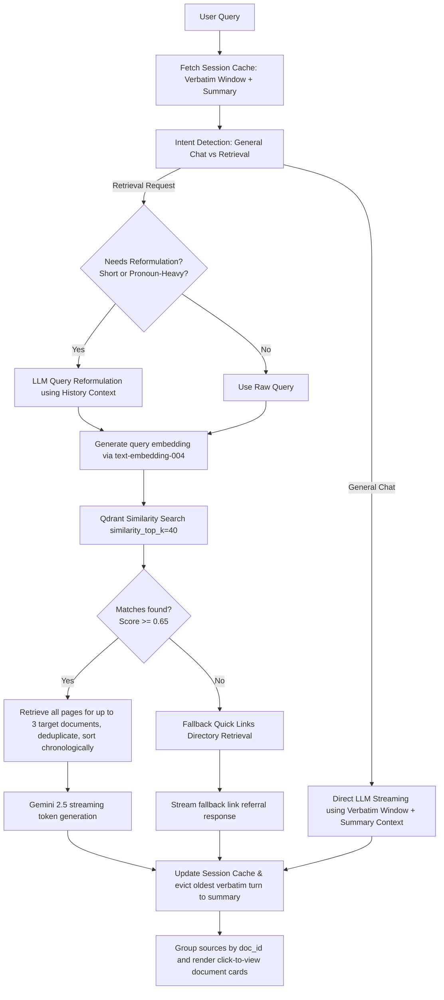

# GN Saarthi — IIT Gandhinagar College Portal Assistant

GN Saarthi is a production-ready, AI-powered college assistant chatbot and administrative console designed for the students, faculty, and administrators of **IIT Gandhinagar (IITGN)**. It enables students to query academic regulations, transport schedules, hostel guidelines, and campus services using a Retrieval-Augmented Generation (RAG) pipeline, while providing administrators with a secure dashboard to ingest new documents and manage service fallback directories.

---

## 🚀 Key Features


- **Generic Context-Aware RAG Synthesis:** Employs a robust, domain-agnostic QA prompt template enforcing exhaustive extraction of tables, rules, lists, and numerical ranges without hardcoding domain-specific rules.
- **Dynamic Chronological Document Retrieval:** Automatically identifies matching document targets (up to 3 files) using initial similarity search ($k=40$), retrieves their entire page context (up to 150 pages) sorted chronologically to resolve page-level text fragmentation.
- **Direct Source Redirection:** Groups cited references by document ID and renders them as unified document cards. Clicking a source card fetches the file via a secure backend API and displays it inline in a new tab.
- **SSE streaming & Typewriter Interface:** Answers query tokens chunk-by-chunk using Server-Sent Events (SSE) rendered in a high-fidelity typewriter UI.
- **Admin Document & Catalog Panel:** Enables administrative ingestion of PDFs and images (using OCR), parsed, split into diverse chunks, and embedded into Qdrant Cloud.
- **Fallback Directory Manager:** Admin interface to manage contact links and portal directories dynamically backed by Google Firestore, which GN Saarthi refers to when documents lack sufficient context.
- **Secure Domain-Locked Auth:** Integrated with Firebase Auth, strictly restricted to `@iitgn.ac.in` G-Suite accounts.

---

## 🛠️ Technology Stack

| Tier | Technology | Description |
|---|---|---|
| **Frontend** | Next.js 16 (Turbopack) | React 19 Framework (TypeScript) |
| | Tailwind CSS v4 | Clean Monochrome Styling System |
| **Backend** | FastAPI | High-performance Python 3.13 API framework |
| | LlamaIndex | Data framework for LLM applications (indices, retrievers, and query engines) |
| | Pydantic v2 | Strict JSON schema parsing and validations |
| **Databases** | Qdrant Cloud | Dense vector store for similarity search |
| | Google Firestore | Quick Links and service fallback directories |
| **Cloud Services** | Vertex AI | Gemini 2.5 Flash (LLM) & text-embedding-004 (Embeddings) |
| | Google Cloud Storage | Reference PDF catalog document store |
| | Firebase Auth | Secure domain-locked identity management |

---

## 📊 Modernization & Performance Comparison (v1.0 vs LlamaIndex)

GN Saarthi was refactored from a custom manual retrieval implementation to a native **LlamaIndex** architecture. This transition significantly reduced boilerplate code while improving context quality and retrieval accuracy.

### 📁 Boilerplate Reduction Breakdown

| Component / File | Manual Version (Lines) | LlamaIndex Version (Lines) | Reduction % | Refactoring Detail |
| :--- | :---: | :---: | :---: | :--- |
| `pipelines/chunker.py` | 103 | 0 (Deleted) | 100% | Deleted custom text chunker; replaced by LlamaIndex's native document parser. |
| `pipelines/vector_store.py` | 240 | 53 | 78% | Replaced custom connection handling, point creation, and schema mapping with `QdrantVectorStore`. |

*Page-level semantic search was fragmented. Chronological document loading solves page gaps. This transition from manual indexing to LlamaIndex increased the accuracy of retrieval from 87% to around ~95%+*


## 🔄 Core Chat Workflow

The following diagram details the query pipeline from the user's browser, through intent parsing, selective query reformulation, vector database lookup, LLM streaming, and hybrid cache updates.



---

## 📁 Project Structure

```
├── backend/
│   ├── app/
│   │   ├── config.py           # Pydantic Settings & environment variables
│   │   ├── dependencies.py     # Firebase Auth verify token & require_admin middlewares
│   │   ├── main.py             # FastAPI entry point & default quick links seeder
│   │   ├── pipelines/          # Document processing & ingestion pipelines
│   │   │   ├── chunker.py      # Recursive splitter with tiktoken tokens
│   │   │   ├── embedder.py     # Vertex AI Embeddings interface
│   │   │   ├── pdf_parser.py   # PDF text extractor with image OCR fallback
│   │   │   └── vector_store.py # Qdrant index initialization & similarity queries
│   │   ├── routers/            # Endpoint handlers (auth, chat, documents, quick links)
│   │   ├── schemas/            # Pydantic schemas (requests & responses)
│   │   └── services/           # Business logic (auth_service, ingestion_service, rag_service)
│   ├── tests/                  # Pytest unit & integration test suite
│   └── requirements.txt        # Python dependencies
├── frontend/
│   ├── app/                    # Next.js App Router pages
│   ├── components/             # Reusable UI components (admin, auth, chat, layout)
│   ├── hooks/                  # Custom React hooks (useChat stream handler)
│   ├── lib/                    # Axios API client & Firebase config
│   ├── types/                  # TypeScript interface definitions
│   └── package.json            # Node.js dependencies
└── README.md
```

---

## ⚙️ Local Setup and Installation

### Prerequisites
- Python 3.13+
- Node.js 18+ & npm
- A Google Cloud Platform (GCP) project with Vertex AI enabled
- Firebase project credentials & GCS bucket configuration
- Qdrant Cloud cluster endpoint & API key

---

### 1. Backend Configuration

1. **Clone the repository** and navigate to the backend folder:
   ```bash
   cd backend
   ```

2. **Initialize a virtual environment** and activate it:
   ```bash
   python -m venv .venv
   # Windows:
   .venv\Scripts\activate
   # macOS/Linux:
   source .venv/bin/activate
   ```

3. **Install python packages**:
   ```bash
   pip install -r requirements.txt
   ```

4. **Environment Variables:** Create a `.env` file in the `backend/` directory following this schema:
   ```ini
   GCP_PROJECT_ID=your-gcp-project-id
   VERTEX_AI_LOCATION=us-central1
   GCS_BUCKET_NAME=your-gcs-bucket-name
   QDRANT_HOST=your-qdrant-host-url
   QDRANT_API_KEY=your-qdrant-api-key
   FIRESTORE_DATABASE_ID=(default)
   FIREBASE_SERVICE_ACCOUNT_JSON={"type": "service_account", ...}
   ```

5. **Run tests to verify configuration**:
   ```bash
   python -m pytest -v
   ```

6. **Start the API Server**:
   ```bash
   uvicorn app.main:app --host 0.0.0.0 --port 8000 --reload
   ```

---

### 2. Frontend Configuration

1. Navigate to the frontend folder:
   ```bash
   cd ../frontend
   ```

2. **Install Node.js dependencies**:
   ```bash
   npm install
   ```

3. **Environment Variables:** Create a `.env.local` file in the `frontend/` directory:
   ```ini
   NEXT_PUBLIC_API_BASE_URL=http://localhost:8000
   NEXT_PUBLIC_FIREBASE_API_KEY=your-firebase-api-key
   NEXT_PUBLIC_FIREBASE_AUTH_DOMAIN=your-firebase-auth-domain
   NEXT_PUBLIC_FIREBASE_PROJECT_ID=your-firebase-project-id
   NEXT_PUBLIC_FIREBASE_APP_ID=your-firebase-app-id
   ```

4. **Start the development server**:
   ```bash
   npm run dev
   ```

Open [http://localhost:3000](http://localhost:3000) in your browser to experience GN Saarthi.

---

## 🔬 Running Tests

The backend includes a comprehensive unit and integration test suite covering authentication, parsing/OCR, vector store queries, session caching, and multi-turn streaming.

To run the full test suite:
```bash
cd backend
python -m pytest -v
```

---

## 🔒 Security & Admin Access
- Authenticating users are validated against Firebase. Any email not ending with `@iitgn.ac.in` is immediately rejected.
- Admin dashboard endpoints require user claims to have `role === 'admin'`, verified by the `require_admin` dependency.
