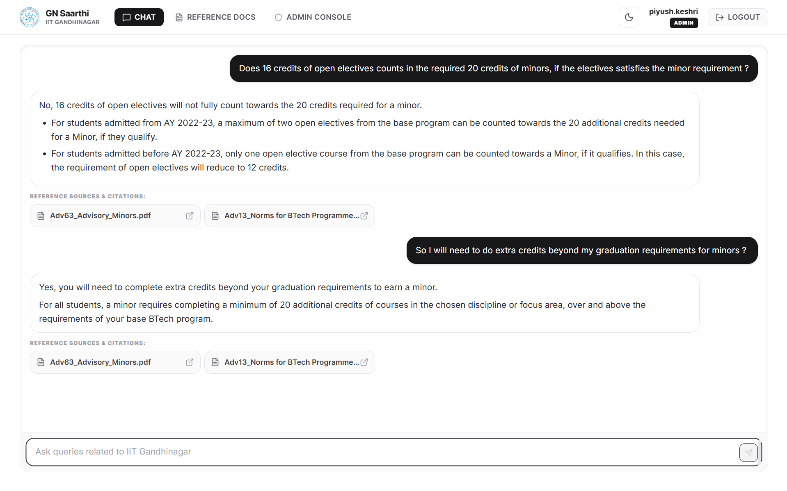
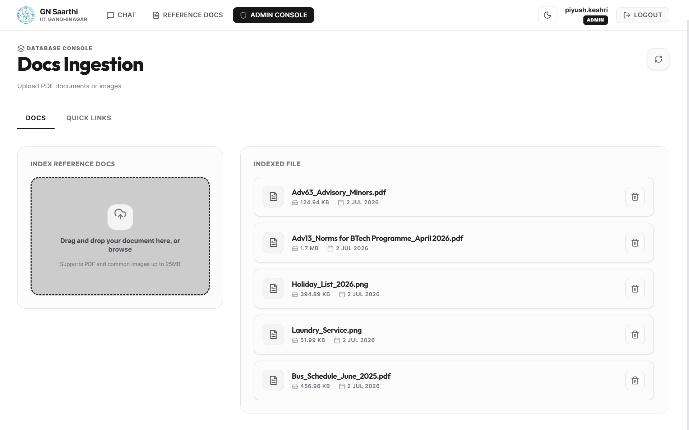
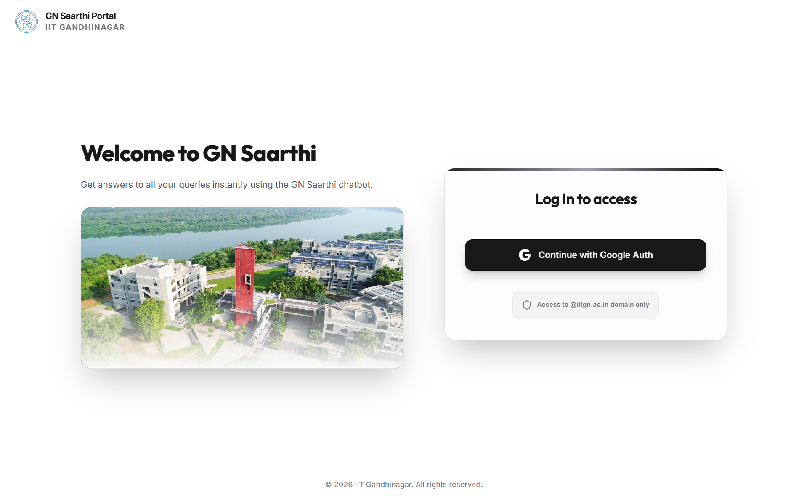
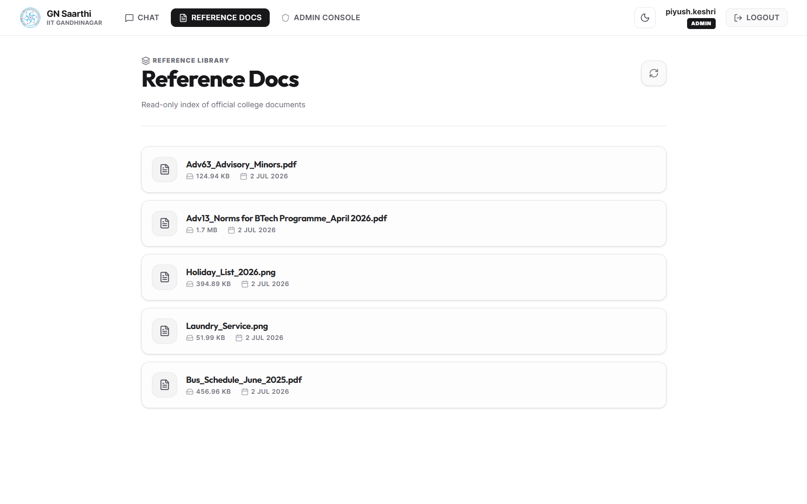
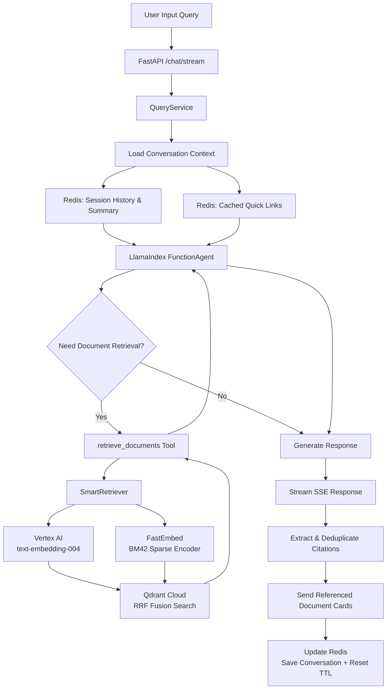
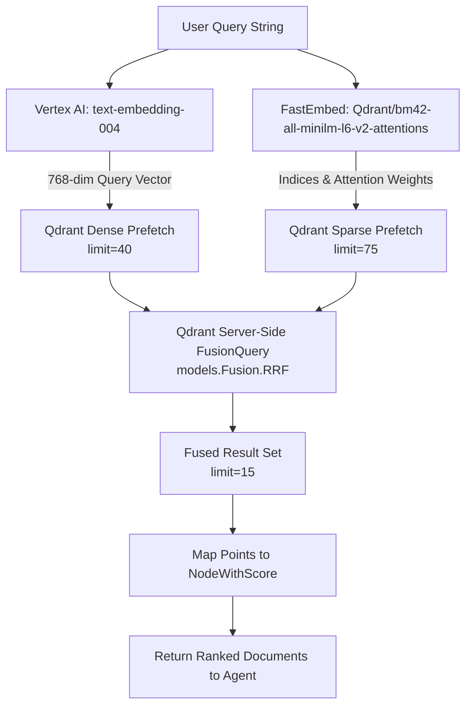

# GN Saarthi — IIT Gandhinagar College Portal Assistant

GN Saarthi is a production-ready, AI-powered college assistant chatbot and administrative console designed for the students, faculty, and administrators of **IIT Gandhinagar (IITGN)**. It enables students to query academic regulations, transport schedules, hostel guidelines, and campus services using an agentic Retrieval-Augmented Generation (RAG) pipeline, while providing administrators with a secure dashboard to ingest new documents, manage service fallback directories, and update portal configurations.

---

## 🚀 Key Features

* **Agentic RAG Architecture**: Built on LlamaIndex `FunctionAgent` powered by `GoogleGenAI` (Gemini 2.5 Flash on Vertex AI), allowing the assistant to dynamically decide whether to retrieve documents, answer conversationally, or refer to fallback directories.
* **Hybrid Vector Search (Dense + Sparse)**: Utilizes Qdrant's native Fusion Query engine performing server-side Reciprocal Rank Fusion (RRF) across Vertex AI dense embeddings (`text-embedding-004`) and Qdrant BM42 sparse representations (`bm42-all-minilm-l6-v2-attentions`).
* **Strict Citation Filtering & Deduplication**:
  * Only displays reference cards for files that are *explicitly cited* by the model.
  * Aggregates and deduplicates citations under a single document card by mapping to `doc_id_key` (the document's unique UUID).
* **Robust Session & Fallback Caching (Redis)**:
  * **Chat Sessions**: Message history and rolling summaries are cached in Redis with dynamic session TTL refreshes.
  * **Startup Pre-Caching**: Fallback quick links from Google Firestore are pre-cached in Redis during the FastAPI startup lifespan hook, eliminating database queries at query time.
* **Local Build Optimization**: The Qdrant BM42 sparse model is pre-downloaded during the Docker build phase and cached in `/app/.fastembed_cache` to prevent runtime latency and read-only filesystem errors on Google Cloud Run.
* **Secure Domain-Locked Auth**: Integrated with Firebase Auth, strictly restricted to `@iitgn.ac.in` G-Suite accounts.

---

## 📸 App Screenshots


### 1. Chat Interface


### 2. Admin Dashboard


### 3. Secure Domain-Locked Login


### 4. Reference Documents Portal


---

## 🔄 Core Agent & RAG Architecture

The following diagram details the workflow from a user's browser query through the LlamaIndex `FunctionAgent`, Redis caching layer, Qdrant hybrid retrieval, and final citation filtering.



---

## 🔍 Hybrid Search Retriever Process Flow

The retrieval step utilizes `SmartRetriever` to perform a highly accurate hybrid search, combining semantic dense vector search with term-frequency-based sparse keyword search. This process runs entirely on the Qdrant Cloud server using Reciprocal Rank Fusion (RRF).



### Retrieval Stages:
1. **Dense Query Embedding**: The input query is converted into a 768-dimensional dense vector via Vertex AI's `text-embedding-004` model. This captures the deep semantic and contextual meaning of the query.
2. **Sparse Term Embedding**: The query is concurrently passed to the local `fastembed` instance to encode sparse BM42 attentions (frequencies and token mappings). This guarantees high precision for specific keywords, codes, and numerical values (such as course codes like `MA 204` or credits ).
3. **Multi-Query Prefetching**:
   * **Prefetch 1 (Dense)**: Looks up the 40 closest vector matches in the `college_docs_v2` collection.
   * **Prefetch 2 (Sparse)**: Looks up the 75 best sparse keyword matches.
4. **Reciprocal Rank Fusion (RRF)**: Qdrant merges both prefetch streams, scoring each document based on its rank in both lists. This native RRF execution removes the need for manual scoring code or python-side fusion.
5. **Top-K Node Construction**: The top 15 ranked points are converted back into LlamaIndex `NodeWithScore` objects containing full document context metadata and page parameters.

---

## 🛠️ Technology Stack

| Tier | Technology | Description |
|---|---|---|
| **Frontend** | Next.js 16 (Turbopack) | React 19 Framework (TypeScript) |
| | Tailwind CSS v4 | Clean Monochrome Styling System |
| **Backend** | FastAPI | High-performance Python 3.13 API framework |
| | LlamaIndex | Data framework for LLM applications (agentic workflows, query engines) |
| | Pydantic v2 | Strict JSON schema parsing and validations |
| **Databases** | Qdrant Cloud | Dense & Sparse vector store supporting hybrid RRF search |
| | Google Firestore | Persistent Quick Links and service fallback directories |
| | Redis (Upstash) | Cache database for session history and quick links |
| **Cloud Services** | Vertex AI | Gemini 2.5 Flash (LLM) & text-embedding-004 (Embeddings) |
| | Google Cloud Storage | Reference PDF catalog document store |
| | Firebase Auth | Secure domain-locked identity management |

---

## 📁 Project Structure

```
├── backend/
│   ├── app/
│   │   ├── config.py           # Pydantic Settings & environment variables
│   │   ├── dependencies.py     # Dependency injections (Auth, Firestore, QueryService)
│   │   ├── main.py             # FastAPI entry point & lifespan startup cache warmer
│   │   ├── pipelines/          # Document processing & ingestion pipelines
│   │   │   ├── embedder.py     # Vertex AI Embeddings interface
│   │   │   ├── pdf_parser.py   # PDF text extractor with image OCR fallback
│   │   │   ├── retriever.py    # Hybrid fusion retriever (Dense + BM42)
│   │   │   └── vector_store.py # Qdrant client connection & delete operations
│   │   ├── routers/            # Endpoint handlers (auth, chat, documents, quick_links)
│   │   ├── schemas/            # Pydantic schemas (requests & responses)
│   │   └── services/           # Business logic
│   │       ├── auth_service.py      # Firebase token verification
│   │       ├── ingestion_service.py # Document parser & vector DB coordinator
│   │       ├── ocr_service.py       # Modern google-genai Gemini OCR Provider
│   │       ├── query_service.py     # Agentic RAG flow & citation aggregator
│   │       └── session_service.py   # Redis session store & summary updates
│   ├── tests/                  # Pytest unit & integration test suite
│   ├── requirements.txt        # Backend python dependencies
│   └── Dockerfile              # Dockerized runtime environment & pre-caching
├── frontend/
│   ├── app/                    # Next.js App Router pages
│   ├── components/             # Reusable UI components (admin, auth, chat, layout)
│   ├── hooks/                  # Custom React hooks (useChat stream handler)
│   ├── lib/                    # Axios API client & Firebase config
│   ├── types/                  # TypeScript interface definitions
│   └── package.json            # Node.js dependencies
└── README.md
```

---

## ⚙️ Local Setup and Installation

### Prerequisites
* Python 3.13+
* Node.js 18+ & npm
* A Google Cloud Platform (GCP) project with Vertex AI enabled
* Firebase project credentials & GCS bucket configuration
* Qdrant Cloud cluster endpoint & API key
* Redis (Upstash) instance URL

---

### 1. Backend Configuration

1. **Navigate to the backend folder**:
   ```bash
   cd backend
   ```

2. **Initialize a virtual environment** and activate it:
   ```bash
   python -m venv .venv
   # Windows:
   .venv\Scripts\activate
   # macOS/Linux:
   source .venv/bin/activate
   ```

3. **Install python packages**:
   ```bash
   pip install -r requirements.txt
   ```

4. **Environment Variables:** Create a `.env` file in the `backend/` directory following this schema:
   ```ini
   GCP_PROJECT_ID=your-gcp-project-id
   VERTEX_AI_LOCATION=us-central1
   GCS_BUCKET_NAME=your-gcs-bucket-name
   QDRANT_URL=https://your-qdrant-cluster.qdrant.io
   QDRANT_API_KEY=your-qdrant-api-key
   QDRANT_COLLECTION_NAME=college_docs_v2
   FIRESTORE_DATABASE_ID=default
   ALLOWED_DOMAIN=iitgn.ac.in
   REDIS_URL=redis://your-redis-url:port
   FIREBASE_SERVICE_ACCOUNT_JSON={"type": "service_account", ...}
   ```

5. **Run the test suite to verify configuration**:
   ```bash
   python -m pytest -v
   ```

6. **Start the API Server**:
   ```bash
   uvicorn app.main:app --host 0.0.0.0 --port 8000 --reload
   ```

---

### 2. Frontend Configuration

1. **Navigate to the frontend folder**:
   ```bash
   cd ../frontend
   ```

2. **Install Node.js dependencies**:
   ```bash
   npm install
   ```

3. **Environment Variables:** Create a `.env.local` file in the `frontend/` directory:
   ```ini
   NEXT_PUBLIC_API_BASE_URL=http://localhost:8000
   NEXT_PUBLIC_FIREBASE_API_KEY=your-firebase-api-key
   NEXT_PUBLIC_FIREBASE_AUTH_DOMAIN=your-firebase-auth-domain
   NEXT_PUBLIC_FIREBASE_PROJECT_ID=your-firebase-project-id
   NEXT_PUBLIC_FIREBASE_APP_ID=your-firebase-app-id
   ```

4. **Start the Next.js development server**:
   ```bash
   npm run dev
   ```

---

## 🔒 Security & Admin Controls

* **Domain Lock**: Users must authenticate using a Firebase account matching the `@iitgn.ac.in` domain. All other emails are rejected.
* **Role Verification**: Admin endpoints (document upload, document deletion, fallback directory management) require user claims to have `role === 'admin'`.
